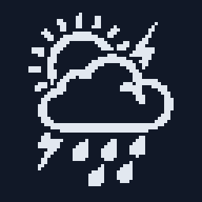
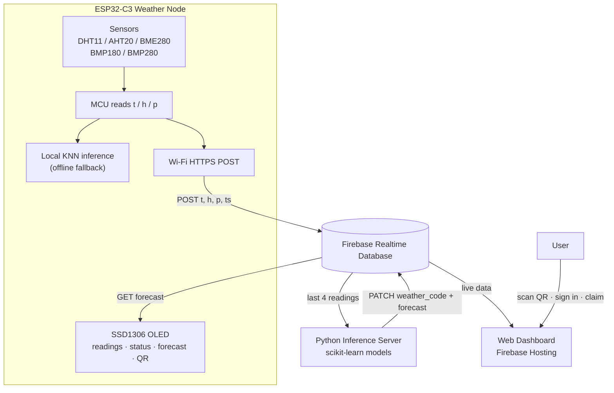
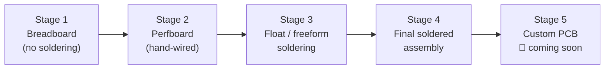

<p align="center">
  
</p>

# Meteorologus ☁️ — IoT Weather Monitoring & Prediction System

<p align="center">
  <a href="https://platformio.org/"></a>
  <a href="https://www.espressif.com/en/products/socs/esp32-c3"></a>
  <a href="https://www.arduino.cc/"></a>
  <a href="https://www.python.org/"></a>
  <a href="https://scikit-learn.org/"></a>
  <a href="https://firebase.google.com/"></a>
</p>

<p align="center">
  <a href="https://github.com/skandapypatriot/meteorologus/commits"></a>
  <a href="https://github.com/skandapypatriot/meteorologus/commits"></a>
  <a href="https://github.com/skandapypatriot/meteorologus/commits"></a>
</p>

**Meteorologus** is a battery-powered weather station that measures temperature, humidity and pressure, predicts the weather **twice over** — once on the microcontroller itself with an embedded KNN model, and again in the cloud with scikit-learn — and shows live readings plus a 3-day forecast on an OLED screen and a web dashboard.

It is designed as a **complete, learnable, end-to-end IoT product**: sensor → firmware → embedded ML → cloud → database → web app, built with cheap off-the-shelf parts and progressing from a breadboard prototype all the way to a custom PCB.

---

## Table of Contents

- [Why Meteorologus Is Useful](#why-meteorologus-is-useful)
- [System Overview](#system-overview)
- [How To Build It](#how-to-build-it)
  - [Stage 1 — Breadboard](#stage-1--breadboard)
  - [Stage 2 — Perfboard](#stage-2--perfboard)
  - [Stage 3 — Float / Freeform Soldering](#stage-3--float--freeform-soldering)
  - [Stage 4 — Final Soldered Assembly](#stage-4--final-soldered-assembly)
  - [Stage 5 — Custom PCB](#stage-5--custom-pcb-coming-soon)
- [Repository Map](#repository-map)
- [Quick Start](#quick-start)
- [Using the Product](#using-the-product)
- [Documentation](#documentation)

---

## Why Meteorologus Is Useful

**As a product**

- 🔋 **Set-and-forget autonomy** — deep sleep between readings gives roughly a month of runtime on a single 18650 cell; no cables on your windowsill.
- 🧠 **Works with *and* without internet** — an on-device KNN model keeps local predictions alive offline; cloud ML refines them whenever Wi-Fi is available.
- 📲 **Zero-config pairing** — a fresh node displays its own QR code; scan, sign in, tap *Claim*, done. No flashing, no serial console, no configuration files for end users.
- 📊 **Real dashboard, real history** — live temperature/humidity/pressure, a temperature sparkline and Now/Day-1/Day-2/Day-3 forecast badges per device.
- 🏠 **Multi-node by design** — every device owns its data under its MAC address; one account can monitor many rooms.

**As a learning project**

- Covers the **full IoT stack**: I²C/one-wire sensing, NVS storage, TLS HTTP, NTP/RTC timekeeping, deep sleep, REST-style cloud sync, security rules, email/password auth, and ML feature engineering (lag features + seasonal encodings).
- Demonstrates **practical TinyML**: a scikit-learn KNN exported to plain C (`modeltoc.py`) running inference on a microcontroller.
- Follows a **realistic hardware bring-up path** — breadboard → perfboard → soldered builds → PCB — exactly how products are actually prototyped.
- Uses only **hobbyist-friendly parts** (ESP32-C3, BME280-class breakouts, SSD1306 OLED, TP4056 charger).

---

## System Overview



**In one sentence:** the node posts readings to Firebase, the Python worker detects fresh data and patches ML forecasts back into the same record, and both the OLED and the website display the result.

---

## How To Build It

Meteorologus is deliberately built in escalating stages of permanence. Each stage produces a *working* device, so you never get stuck with a half-finished brick.



### Stage 1 — Breadboard

**Goal:** prove the electronics and firmware before any permanent connection.

- Place the ESP32-C3, sensor breakouts and OLED on a full-size breadboard.
- Wire I²C (SDA → GPIO 8, SCL → GPIO 9) shared by the OLED, RTC and pressure sensor; put the DHT11 data pin on GPIO 7.
- Flash the firmware from [`firmware/`](firmware/) and confirm sensor auto-detection in the serial log.
- Iterate freely: swap sensors, change pins, test deep-sleep current with a multimeter.

> ✅ **Exit criteria:** all screens render, sensors are detected, Wi-Fi connects, data appears in Firebase.

### Stage 2 — Perfboard

**Goal:** a semi-permanent build that survives being picked up and moved.

- Transfer the proven layout onto perfboard (protoboard); sockets/headers let you still remove the MCU.
- Point-to-point solder the rails: 3V3, GND, I²C bus and the switched peripheral rail (a BC547 on GPIO 10 cuts OLED + sensor power completely during sleep).
- Add the power section: 18650 holder → TP4056 (Type-C, with protection) → 3V3 regulator, plus a switch.
- Keep the wake button (GPIO 3) and leave one spare header row for future add-ons.

> ✅ **Exit criteria:** the device runs for days without resets; measured sleep current matches expectations (~25–50 µA core draw).

### Stage 3 — Float / Freeform Soldering

**Goal:** minimum-volume experimental builds where boards are stacked or suspended.

- Solder modules directly to each other — pins to pads, no substrate — letting assemblies "float".
- Ideal for wearing the node, embedding it in a case, or squeezing it into a window sensor enclosure.
- Strain-relieve every wire (hot glue / kapton); freeform joints are strong but unforgiving.

> ⚠️ This stage is optional — skip straight to Stage 4 if you prefer a conventional build.

### Stage 4 — Final Soldered Assembly

**Goal:** the finished, presentable unit.

- Mount the perfboard/freeform stack in an enclosure with an OLED window and ventilation slots for the sensors.
- Secure the battery, add the flash/wake button through the case, label the QR pairing flow.
- Run a full end-to-end validation: pair via QR, verify dashboard updates, confirm a full sleep/wake cycle.

> ✅ **Exit criteria:** a device you can hand to someone else with only a QR code and no instructions.

### Stage 5 — Custom PCB *RELEASED 10/10/2026!!!*

A dedicated PCB is planned to replace the perfboard stage entirely:

- Single-board integration: ESP32-C3 module, sensor footprints (BME280 + BMP280 alternatives), OLED connector, TP4056 charging, LiPo pad, boot/wake buttons.
- Proper power tree with a load switch driven by GPIO 10, and test points for current profiling.
- Design files, schematics and ordering links will land in this repository — watch the [`firmware/`](firmware/) and root README for updates.

---

## Repository Map

| Folder | What lives there | Documentation |
| :--- | :--- | :--- |
| [`firmware/`](firmware/) | ESP32-C3 PlatformIO project — sensors, OLED UI, deep sleep, on-device KNN, cloud sync | [firmware/README.md](firmware/README.md) |
| [`inferenceserver/`](inferenceserver/) | Python worker — polls Firebase, runs scikit-learn models, patches forecasts | [inferenceserver/README.md](inferenceserver/README.md) |
| [`website/`](website/) | Firebase-hosted dashboard — auth, QR device claiming, live device cards | [website/README.md](website/README.md) |

---

## Quick Start

Each component has its own detailed guide — here is the 60-second version:

**1. Firmware** — set your Wi-Fi credentials in `firmware/src/main.cpp`, then:

```powershell
cd firmware
pio run -t upload          # flash
pio device monitor         # watch it boot @ 115200
```

**2. Website** — create `website/public/config.js` with your Firebase config, enable Email/Password auth, then:

```powershell
cd website
firebase deploy
```

**3. Inference server** — start the prediction worker:

```powershell
cd inferenceserver
pip install -r requirements.txt
python main.py
```

---

## Using the Product

Full walkthroughs live in [`website/README.md`](website/README.md); the short version:

**Register**
1. Open `https://<your-project>.web.app`.
2. Click **Create a new account**, enter email + password (min. 6 chars), submit — you're signed in instantly.

**Log in**
1. Open the same URL, ensure the form says **Sign in**.
2. Enter your credentials and click **Sign in** — your devices load automatically.

**Claim a node**
1. Power the node near your Wi-Fi; it shows **NOT PAIRED YET** and a QR code.
2. Scan the QR (or type the shown URL), sign in, click **Claim device**.
3. Within ~30 s the node fetches its key and starts syncing automatically.

---

## Documentation

| Document | Contents |
| :--- | :--- |
| [firmware/README.md](firmware/README.md) | Wiring & pinout, build flags, screens, provisioning, sleep tuning, troubleshooting |
| [inferenceserver/README.md](inferenceserver/README.md) | Prediction pipeline, health endpoint, model retraining/export, Render deployment |
| [website/README.md](website/README.md) | Firebase setup, security rules, deploy steps, account & claim walkthroughs |

---

*Built with ESP32-C3 · PlatformIO · Firebase · scikit-learn*
