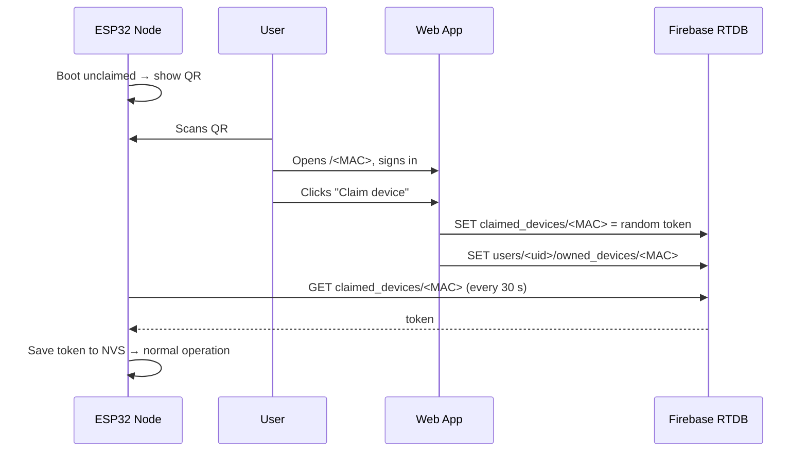
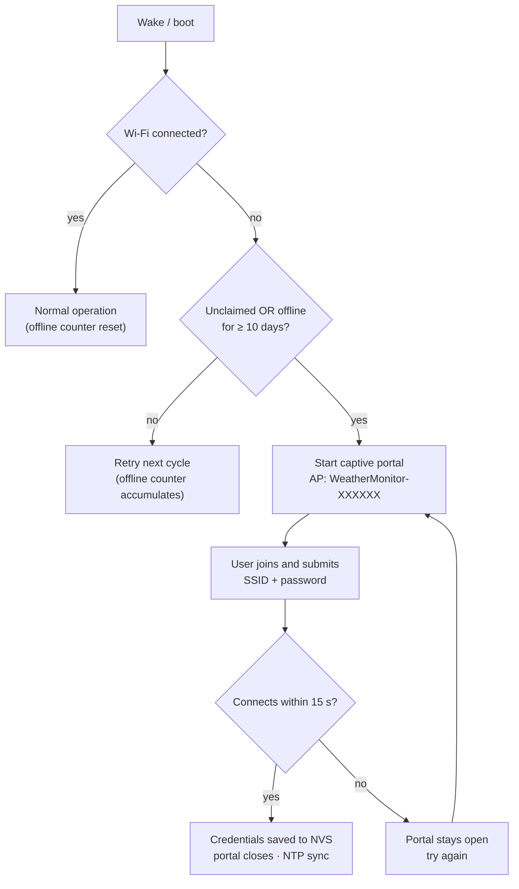

# Firmware — ESP32-C3 Weather Node

The Meteorologus firmware turns an ESP32-C3 into a self-contained weather node: it auto-detects its sensors, renders a multi-screen OLED UI, runs an embedded KNN weather model offline, syncs readings and forecasts with Firebase, and deep-sleeps between cycles for ~1 month of battery life.

---

## Table of Contents

- [Building the Project (Hardware)](#building-the-project-hardware)
  - [Parts List (BOM)](#parts-list-bom)
  - [Wiring & Pinout](#wiring--pinout)
  - [Peripheral Power Switch (BC547)](#peripheral-power-switch-bc547)
  - [Assembly Order](#assembly-order)
- [Setup](#setup)
- [Build, Flash & Monitor](#build-flash--monitor)
- [Build Flags](#build-flags)
- [Device Behaviour](#device-behaviour)
  - [Boot Sequence](#boot-sequence)
  - [OLED Screens](#oled-screens)
  - [Provisioning / Claim Flow](#provisioning--claim-flow)
  - [Wi-Fi Setup Portal](#wi-fi-setup-portal)
  - [Deep Sleep](#deep-sleep)
- [On-Device ML Model](#on-device-ml-model)
- [Cloud Sync Details](#cloud-sync-details)
- [Troubleshooting](#troubleshooting)

---

## Building the Project (Hardware)

Everything physical lives in this section: the parts you need, how they connect, the transistor power switch that makes the battery budget work, and the order to assemble them in. For the prototyping progression (breadboard → perfboard → soldered builds → PCB), see the [root README](../README.md#how-to-build-it).

### Parts List (BOM)

| Component | Role | Notes |
| :--- | :--- | :--- |
| ESP32-C3 Mini | MCU (Wi-Fi, BLE disabled at runtime) | `esp32-c3-devkitm-1` board target |
| DHT11 *(or AHT20 / BME280)* | Temperature + humidity | Auto-detected at boot, priority: BME280 > AHT20 > DHT11 |
| BMP180 *(or BMP280 / BME280)* | Barometric pressure | Auto-detected, addresses 0x76/0x77 scanned |
| SSD1306 0.96" OLED 128×64 | Display (U8g2, hardware I²C) | Address 0x3C |
| DS3231 RTC *(optional)* | Timekeeping through sleep | Address 0x68; **always powered** — never behind the switch |
| **BC547** (NPN, TO-92) | Peripheral power switch | Cuts OLED + sensors completely during sleep |
| 1 kΩ resistor | Base resistor for BC547 | GPIO 10 → base |
| 10 kΩ resistor | Base pull-down | Keeps switch OFF during boot/reset |
| 4.7 kΩ resistor | DHT11 data pull-up | Only if using a DHT11 |
| 18650 + TP4056 (Type-C) | Power | Protection circuit recommended |
| Flash/wake button | Wake from deep sleep | GPIO 3, active-low |

### Wiring & Pinout

| Signal | GPIO | Connected to |
| :--- | :--- | :--- |
| DHT11 data | **7** | DHT11 out (4.7k pull-up recommended) |
| I²C SDA | **8** | OLED, RTC, pressure sensor, AHT20 |
| I²C SCL | **9** | OLED, RTC, pressure sensor, AHT20 |
| Wake button | **3** | Button to GND (GPIO-low wakeup) |
| **BC547 base** | **21** | Via 1 kΩ resistor (see below) |

I²C addresses probed at boot: `0x68` (DS3231), `0x77` (BMP180/BMP280/BME280), `0x3C` (SSD1306), plus `0x38` (AHT20) and `0x76` (BMP280/BME280 alt).

### Peripheral Power Switch (BC547)

Deep sleep alone (~25–50 µA) is wasted if the OLED and sensors keep drawing milliamps forever. A BC547 NPN transistor acts as a **low-side switch**: the firmware drives it ON while awake and OFF right before sleeping, so the peripherals are disconnected from GND entirely — true zero current, not just "sleeping" peripherals.

```
   GPIO 10 ──[ 1 kΩ ]──┬──► Base          BC547  (flat side facing you:
                       │                          C  B  E)
                    [10 kΩ]                     │
                       │                        │
                      GND                       │

   ┌──────────────────────────┐
   │  OLED · DHT11/AHT20/BME  │  VCC ──► 3V3 (always on)
   │  BMP180/BMP280           │
   │  GND ──────► Collector   │
   └──────────────────────────┘
                              Emitter ──► GND
```

**How to wire it**

1. **Emitter → GND** (battery negative).
2. **Collector → GND pin of the OLED and all *switched* sensors** (their VCC pins stay on 3V3).
3. **Base → GPIO 10 through the 1 kΩ resistor.**
4. **10 kΩ pull-down from base to GND** — ESP32 GPIOs float during boot/reset; this holds the switch OFF so peripherals never get phantom power.
5. **DS3231 RTC stays OUT of the switched group** — wire its GND directly to battery GND so timekeeping survives sleep.

**Logic (matches the firmware exactly)**

| GPIO 10 | BC547 | Peripherals |
| :--- | :--- | :--- |
| HIGH | ON | Powered — normal operation |
| LOW *(before deep sleep)* | OFF | Fully disconnected — 0 mA |

*Pinout reminder:* holding the BC547 flat side toward you, the legs are **Collector – Base – Emitter** left to right.

**Design notes**

- Load is well within limits: OLED (~15 mA) + sensors (< 5 mA) ≪ BC547's ~100 mA max.
- The ~0.2 V collector-emitter saturation drop is negligible for these devices.
- Keep I²C pull-ups at 10 kΩ rather than 4.7 kΩ where possible — when the switched group is off, pull-ups to 3V3 can back-feed a few µA through the unpowered chips' protection diodes. Higher resistance keeps that leakage negligible.

### Assembly Order

1. **Breadboard everything first** — MCU, sensors, OLED, button — and verify detection in the serial log (no transistor yet).
2. Add the TP4056 + 18650 supply and confirm the node runs on battery.
3. Wire the BC547 stage (base resistor, pull-down, switched GND rail) and confirm the OLED blanks out the instant the log prints `[sleep] Entering Deep Sleep`.
4. Move to perfboard following the layout that worked, sockets/headers for the MCU first, then the switched-GND star to the transistor.
5. Enclose, label, done — pairing itself needs no computer (QR code).

---

## Setup

1. Install [PlatformIO](https://platformio.org/) (VS Code extension or `pip install platformio`).
2. Edit `src/main.cpp` and set your network:

```cpp
#define WIFI_SSID "YourWiFiName"
#define WIFI_PASS "YourWiFiPassword"
```

> ⚠️ Don't commit real credentials — prefer build flags or a git-ignored header. These values are only **fallback defaults**: credentials entered through the [Wi-Fi Setup Portal](#wi-fi-setup-portal) are stored on-device and take priority.

3. If you use a different Firebase project, also update:

```cpp
#define FIREBASE_BASE_URL "https://<your-project>-default-rtdb.firebaseio.com"
#define CLAIM_WEB_BASE    "https://<your-project>.web.app/"
```

## Build, Flash & Monitor

```powershell
pio run                    # compile
pio run -t upload          # flash over USB
pio device monitor         # serial console @ 115200
pio run -t erase           # wipe NVS (forces re-pairing + clears portal credentials)
```

## Build Flags

Set in `platformio.ini` under `build_flags`:

| Flag | Default | Effect |
| :--- | :--- | :--- |
| `-DLOGGING_ENABLED=1` | `1` | Serial logging; `0` compiles all logs out |
| `-DRTC_SUPPORT=1` | `1` | DS3231 support; `0` removes RTC code entirely |
| `-DARDUINO_LOOP_STACK_SIZE=65536` | — | Larger loop stack for model inference |

Timing constants live in `src/main.cpp`:

| Constant | Value | Meaning |
| :--- | :--- | :--- |
| `DEEP_SLEEP_DURATION_US` | 1 hour | Timer wake interval |
| `AWAKE_DURATION` | 20 s | Awake window before sleeping (claimed mode) |
| `FIREBASE_SYNC_INTERVAL` | 12 s | Cloud sync cadence while awake |
| `PROVISION_RECHECK_INTERVAL` | 30 s | Claim poll rate while unpaired |
| `SCREEN_DURATION` | 5 s | Per-screen display time |
| `WIFI_OFFLINE_LIMIT_SECONDS` | 10 days | Cumulative offline time before a claimed node opens the setup portal |

## Device Behaviour

### Boot Sequence

```
Cold boot / timer wake / button wake
  → logo splash
  → I²C scan + sensor auto-detection
  → load Wi-Fi credentials (NVS "wifi") + claim key (NVS "auth")
  → Wi-Fi connect (5 s timeout) → NTP sync (IST, +5:30)
      ├─ connected            → normal operation
      └─ no network AND (unclaimed OR offline ≥ 10 days) → Wi-Fi Setup Portal
  → claim check → local KNN prediction → first Firebase sync → screens start
```

### OLED Screens

Claimed nodes cycle three screens every 5 s:

1. **Live readings** — clock, big temperature, humidity & pressure.
2. **Connectivity** — Wi-Fi state, signal bars (RSSI-mapped), forecast source (`Firebase` vs `Local AI`).
3. **Forecast** — three day-icons on top, today's condition with icon below.

Unpaired nodes alternate between an instructions screen and a full-screen QR code encoding `https://<host>/<DEVICE_MAC>`.

### Provisioning / Claim Flow



- The token is stored in NVS namespace `auth` as `device_key`.
- Every cloud write is rejected by security rules unless the device is listed in `/claimed_devices/<MAC>`.
- If Firebase answers `401/403`, the firmware clears the stored key and returns to pairing mode automatically.

### Wi-Fi Setup Portal

Instead of failing silently when it can't reach a network, the node hosts its own **captive portal** so Wi-Fi can be configured from any phone — no USB, no recompile.



**When it activates**

| Trigger | Condition |
| :--- | :--- |
| Unclaimed node | No claim key stored and no Wi-Fi connection |
| Prolonged outage | Claimed node has been offline cumulatively ≥ `WIFI_OFFLINE_LIMIT_SECONDS` (10 days) — tracked across deep-sleep cycles in NVS |

**How to use it**

1. On your phone, join the open network **`WeatherMonitor-<last 6 of MAC>`**.
2. The config page pops up automatically (captive portal); otherwise open **`http://192.168.4.1`**.
3. Enter the SSID and password (leave the password blank for open networks) and submit.
4. The device saves the credentials to NVS and tests the connection for up to 15 s:
   - **Success** → portal closes, NTP re-syncs, normal operation resumes.
   - **Failure** → the portal stays open so you can correct the details.

**Notes**

- Stored credentials override the compile-time `WIFI_SSID`/`WIFI_PASS` fallbacks and persist until changed via the portal or erased with `pio run -t erase`.
- While the portal is active the node stays awake and pauses sensor syncing/deep sleep — it resumes once connected.
- A claimed device checks periodically between syncs, so even a deployed node can enter setup mode after a long outage without a button press or reboot.

### Deep Sleep

After the awake window the node turns the peripheral power switch off (GPIO 10 → BC547 cuts OLED + sensors completely), arms GPIO-low wakeup on the button plus a 1-hour timer wake, and enters deep sleep. On wake the device fully resets and repeats the boot sequence. Set `ENABLE_SLEEP = false` in `main.cpp` while debugging.

## On-Device ML Model

- `models/weather_model_same.h` contains a KNN classifier (training vectors + labels) exported from scikit-learn as plain C.
- `models/scalers.h` holds the feature scaler constants; `models/weather_model_3d.h` the 3-day variant.
- `src/models.cpp/.h` wraps them behind `run_local_prediction()`; it runs once readings stabilise and again whenever the forecast screen is shown.
- To regenerate after retraining, run [`inferenceserver/modeltoc.py`](../inferenceserver/modeltoc.py) and copy the produced header into `firmware/models/`.

## Cloud Sync Details

- **POST** `{t, h, p, ts}` appends a node under `/devices/<MAC>` (only when claimed and time is valid).
- **GET** the last 10 nodes ordered by key; the newest one carrying `forecast` wins and updates the UI.
- All requests go over HTTPS (`WiFiClientSecure`, cert verification currently disabled via `setInsecure()`).

## Troubleshooting

Serial logs print exact disconnect reasons. Common ones:

| Log | Meaning | Fix |
| :--- | :--- | :--- |
| `202 AUTH_FAIL` / `15 4WAY_HANDSHAKE_TIMEOUT` | Wrong password | Re-enter credentials via the setup portal |
| `201 NO_AP_FOUND` | SSID not visible/out of range | Check SSID, move closer; scan list is printed |
| Portal never appears | Not unclaimed and offline < 10 days | Erase NVS (`pio run -t erase`) to force pairing mode |
| Can't find `WeatherMonitor-…` hotspot | Portal not active | Check serial log for `[wifi] Setup portal started` |
| Portal page doesn't pop up | Captive portal blocked by phone | Open `http://192.168.4.1` manually |
| New credentials rejected repeatedly | Wrong password/out of range | Portal stays open — retry; watch serial log for reason codes |
| `RTC Error` on screen 1 | DS3231 missing or lost power | Expected without RTC; NTP takes over |
| Stuck on pairing screen | Never claimed | Complete the QR flow; check `CLAIM_WEB_BASE` matches your deployed site |
| `401/403` on POST | Claim revoked or rules changed | Device auto-clears key → re-pair |
| Forecast stuck on `Local AI` | Server not running / no fresh data | See [inferenceserver README](../inferenceserver/README.md) |
| OLED/sensors dead permanently | BC547 wired backwards or base resistor missing | Verify C-B-E orientation and the GPIO 10 → 1 kΩ → base path |
