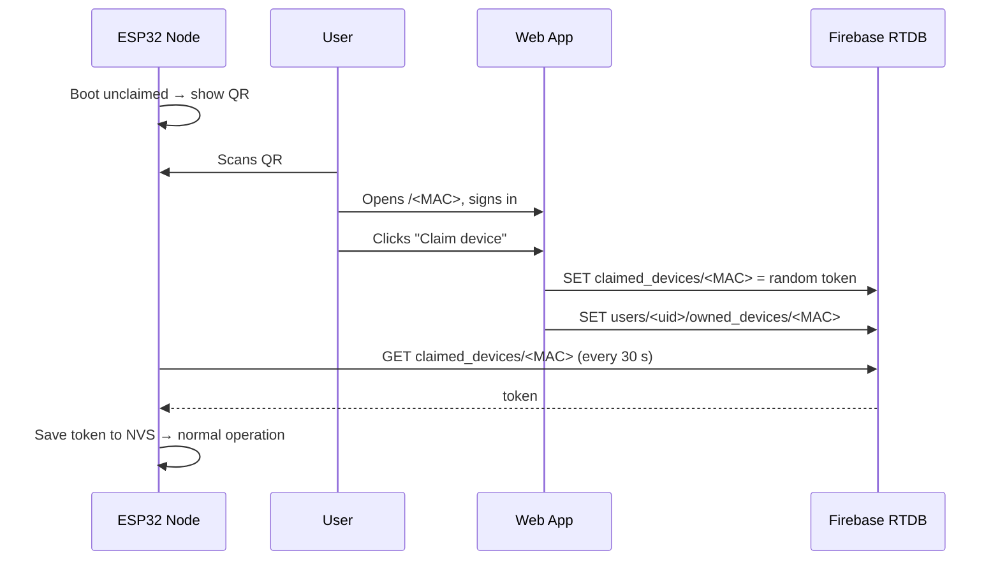

# Firmware — ESP32-C3 Weather Node

The Meteorologus firmware turns an ESP32-C3 into a self-contained weather node: it auto-detects its sensors, renders a multi-screen OLED UI, runs an embedded KNN weather model offline, syncs readings and forecasts with Firebase, and deep-sleeps between cycles for ~1 month of battery life.

---

## Table of Contents

- [Hardware](#hardware)
- [Wiring & Pinout](#wiring--pinout)
- [Setup](#setup)
- [Build, Flash & Monitor](#build-flash--monitor)
- [Build Flags](#build-flags)
- [Device Behaviour](#device-behaviour)
  - [Boot Sequence](#boot-sequence)
  - [OLED Screens](#oled-screens)
  - [Provisioning / Claim Flow](#provisioning--claim-flow)
  - [Deep Sleep](#deep-sleep)
- [On-Device ML Model](#on-device-ml-model)
- [Cloud Sync Details](#cloud-sync-details)
- [Troubleshooting](#troubleshooting)

---

## Hardware

| Component | Role | Notes |
| :--- | :--- | :--- |
| ESP32-C3 Mini | MCU (Wi-Fi, BLE disabled at runtime) | `esp32-c3-devkitm-1` board target |
| DHT11 *(or AHT20 / BME280)* | Temperature + humidity | Auto-detected at boot, priority: BME280 > AHT20 > DHT11 |
| BMP180 *(or BMP280 / BME280)* | Barometric pressure | Auto-detected, addresses 0x76/0x77 scanned |
| SSD1306 0.96" OLED 128×64 | Display (U8g2, hardware I²C) | Address 0x3C |
| DS3231 RTC *(optional)* | Timekeeping through sleep | Address 0x68; falls back to NTP if absent |
| 18650 + TP4056 (Type-C) | Power | Protection circuit recommended |
| Flash/wake button | Wake from deep sleep | GPIO 3, active-low |

## Wiring & Pinout

| Signal | GPIO | Connected to |
| :--- | :--- | :--- |
| DHT11 data | **7** | DHT11 out (4.7k pull-up recommended) |
| I²C SDA | **8** | OLED, RTC, pressure sensor, AHT20 |
| I²C SCL | **9** | OLED, RTC, pressure sensor, AHT20 |
| Wake button | **3** | Button to GND (GPIO-low wakeup) |
| Peripheral power rail | **10** | High-side switch for sensors/OLED; driven LOW before sleep |

I²C addresses probed at boot: `0x68` (DS3231), `0x77` (BMP180/BMP280/BME280), `0x3C` (SSD1306), plus `0x38` (AHT20) and `0x76` (BMP280/BME280 alt).

## Setup

1. Install [PlatformIO](https://platformio.org/) (VS Code extension or `pip install platformio`).
2. Edit `src/main.cpp` and set your network:

```cpp
#define WIFI_SSID "YourWiFiName"
#define WIFI_PASS "YourWiFiPassword"
```

> ⚠️ Don't commit real credentials — prefer build flags or a git-ignored header.

### WiFi recovery hotspot

The device stores the working SSID and password in NVS. If WiFi cannot be
found while the device has no Firebase claim key, it starts a setup hotspot
named `WeatherMonitor-<device-id>`. It also starts the hotspot after 10 days
without WiFi, even for a previously claimed device. Connect to that hotspot
and open `http://192.168.4.1`, or use the captive-portal notification, to enter
new credentials. The device tests the new network and keeps the portal open
until it connects successfully.

3. If you use a different Firebase project, also update:

```cpp
#define FIREBASE_BASE_URL "https://<your-project>-default-rtdb.firebaseio.com"
#define CLAIM_WEB_BASE    "https://<your-project>.web.app/"
```

## Build, Flash & Monitor

```powershell
pio run                    # compile
pio run -t upload          # flash over USB
pio device monitor         # serial console @ 115200
pio run -t erase           # wipe NVS (forces re-pairing)
```

## Build Flags

Set in `platformio.ini` under `build_flags`:

| Flag | Default | Effect |
| :--- | :--- | :--- |
| `-DLOGGING_ENABLED=1` | `1` | Serial logging; `0` compiles all logs out |
| `-DRTC_SUPPORT=1` | `1` | DS3231 support; `0` removes RTC code entirely |
| `-DARDUINO_LOOP_STACK_SIZE=65536` | — | Larger loop stack for model inference |

Timing constants live in `src/main.cpp`:

| Constant | Value | Meaning |
| :--- | :--- | :--- |
| `DEEP_SLEEP_DURATION_US` | 1 hour | Timer wake interval |
| `AWAKE_DURATION` | 20 s | Awake window before sleeping (claimed mode) |
| `FIREBASE_SYNC_INTERVAL` | 12 s | Cloud sync cadence while awake |
| `PROVISION_RECHECK_INTERVAL` | 30 s | Claim poll rate while unpaired |
| `SCREEN_DURATION` | 5 s | Per-screen display time |

## Device Behaviour

### Boot Sequence

```
Cold boot / timer wake / button wake
  → logo splash
  → I²C scan + sensor auto-detection
  → Wi-Fi connect (5 s timeout) → NTP sync (IST, +5:30)
  → load claim key from NVS ("auth" namespace)
      ├─ key found  → claimed mode
      └─ no key     → poll cloud once → else pairing mode (QR)
  → local KNN prediction → first Firebase sync → screens start
```

### OLED Screens

Claimed nodes cycle three screens every 5 s:

1. **Live readings** — clock, big temperature, humidity & pressure.
2. **Connectivity** — Wi-Fi state, signal bars (RSSI-mapped), forecast source (`Firebase` vs `Local AI`).
3. **Forecast** — three day-icons on top, today's condition with icon below.

Unpaired nodes alternate between an instructions screen and a full-screen QR code encoding `https://<host>/<DEVICE_MAC>`.

### Provisioning / Claim Flow



- The token is stored in NVS namespace `auth` as `device_key`.
- Every cloud write is rejected by security rules unless the device is listed in `/claimed_devices/<MAC>`.
- If Firebase answers `401/403`, the firmware clears the stored key and returns to pairing mode automatically.

### Deep Sleep

After the awake window the node cuts peripheral power (GPIO 10), arms GPIO-low wakeup on the button plus a 1-hour timer wake, and enters deep sleep. On wake the device fully resets and repeats the boot sequence. Set `ENABLE_SLEEP = false` in `main.cpp` while debugging.

## On-Device ML Model

- `models/weather_model_same.h` contains a KNN classifier (training vectors + labels) exported from scikit-learn as plain C.
- `models/scalers.h` holds the feature scaler constants; `models/weather_model_3d.h` the 3-day variant.
- `src/models.cpp/.h` wraps them behind `run_local_prediction()`; it runs once readings stabilise and again whenever the forecast screen is shown.
- To regenerate after retraining, run [`inferenceserver/modeltoc.py`](../inferenceserver/modeltoc.py) and copy the produced header into `firmware/models/`.

## Cloud Sync Details

- **POST** `{t, h, p, ts}` appends a node under `/devices/<MAC>` (only when claimed and time is valid).
- **GET** the last 10 nodes ordered by key; the newest one carrying `forecast` wins and updates the UI.
- All requests go over HTTPS (`WiFiClientSecure`, cert verification currently disabled via `setInsecure()`).

## Troubleshooting

Serial logs print exact disconnect reasons. Common ones:

| Log | Meaning | Fix |
| :--- | :--- | :--- |
| `202 AUTH_FAIL` / `15 4WAY_HANDSHAKE_TIMEOUT` | Wrong password | Check `WIFI_PASS` |
| `201 NO_AP_FOUND` | SSID not visible/out of range | Check `WIFI_SSID`, move closer; scan list is printed |
| `RTC Error` on screen 1 | DS3231 missing or lost power | Expected without RTC; NTP takes over |
| Stuck on pairing screen | Never claimed | Complete the QR flow; check `CLAIM_WEB_BASE` matches your deployed site |
| `401/403` on POST | Claim revoked or rules changed | Device auto-clears key → re-pair |
| Forecast stuck on `Local AI` | Server not running / no fresh data | See [inferenceserver README](../inferenceserver/README.md) |
